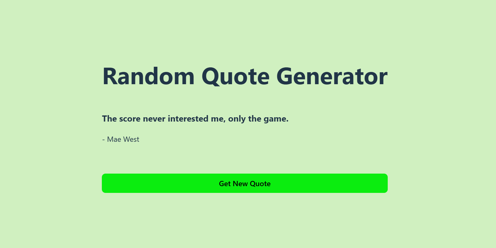

# Random Quote Generator Mini Project(Fullstack)

A **fullstack random quote generator** built with **React (frontend)** and **Node.js + Express (backend)**. The backend fetches quotes from an API and serves them to the frontend.

---

## 🌟 Features
- Generates a **random quote** on button click
- **Fullstack implementation** (React + Express + Node.js)
- Deployed on **Render (Backend) & Vercel/Netlify (Frontend)**
- **CORS-enabled** API for smooth communication

---

## 📂 Project Structure

```
📦 random-quote-generator
├── 📂 backend  (Express Server)
│   ├── server.js  # Backend logic
│   ├── package.json  # Dependencies
│   ├── package-lock.json
│   ├── .gitignore
│
├── 📂 frontend  (React App)
│   ├── src/
│   │   ├── App.jsx  # Main component
│   │   ├── index.js  # React entry point
│   ├── public/
│   ├── package.json  # Dependencies
│   ├── package-lock.json
│   ├── vite.config.js  # Vite configuration
│   ├── .gitignore
│
└── README.md  # Documentation
```

---

## 🚀 Deployment Links
- **Frontend:** [Live Here](https://fullstack-mini-project.vercel.app/)
- **Backend:** [Live Here](https://server-7a3r.onrender.com/random-quote)

---

## 🛠️ Tech Stack
- **Frontend:** React (Vite)
- **Backend:** Node.js + Express
- **API Calls:** Axios
- **Deployment:** Vercel (Frontend) & Render (Backend)

---

## 🔧 Installation & Setup

### **1️⃣ Clone the Repository**
```sh
git clone https://github.com/your-username/random-quote-generator.git
cd random-quote-generator
```

### **2️⃣ Backend Setup**
```sh
cd backend
npm install  # Install dependencies
npm run dev  # Start backend server (localhost:5000)
```

### **3️⃣ Frontend Setup**
```sh
cd ../frontend
npm install  # Install dependencies
npm run dev  # Start frontend server (localhost:5173)
```

---

## 📡 API Endpoints
| Method | Endpoint            | Description               |
|--------|---------------------|---------------------------|
| GET    | `/random-quote`     | Fetches a random quote   |

---

## 📸 Screenshots

---

## 🤝 Contributing
1. **Fork** the repository.
2. **Clone** it locally: frontend `git clone https://github.com/DarshanCode2005/Frontend-Mini-Project.git` & backend https://github.com/DarshanCode2005/Server.git
3. **Create a feature branch**: `git checkout -b feature-name`
4. **Commit changes**: `git commit -m "Added new feature"`
5. **Push to GitHub**: `git push origin feature-name`
6. **Create a Pull Request** 🚀

---

## 📜 License
This project is licensed under the **MIT License**.

---

## 📩 Contact
If you have any questions, feel free to reach out:
📧 Email: [darshanthakare05@gmail.com](mailto:darshanthakare05@gmail.com)

Happy Coding! 🚀